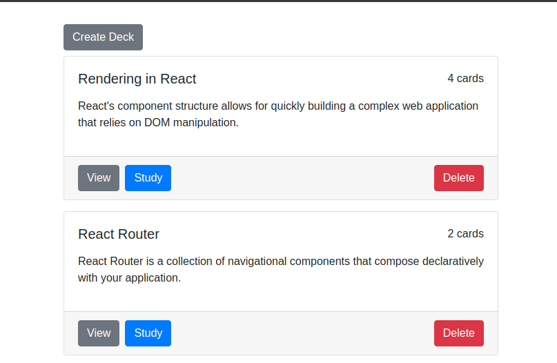
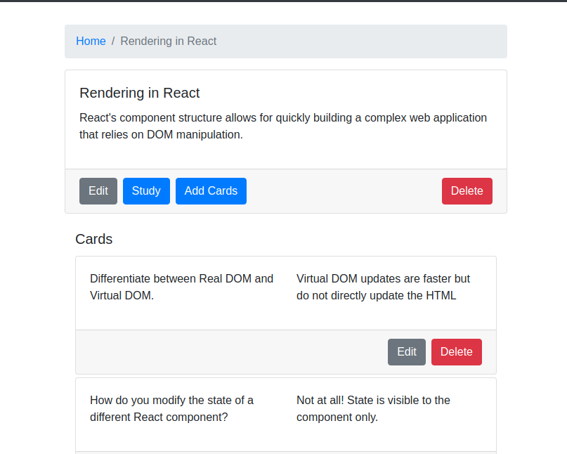
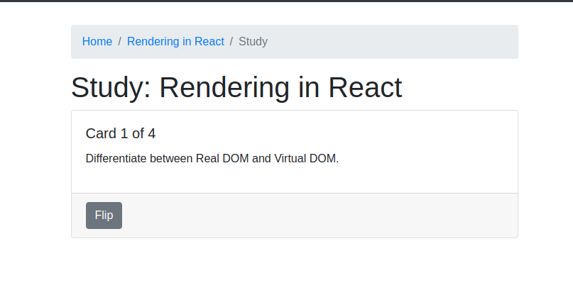

# Flashcard-O-Matic
Flashcard-o-matic, to helps students study online. Teachers/Parents can use this application to create decks of flash cards for the subjects that they teach, and students will study the decks. 

# Installing & Running
#### Installing
Use the following commands to install the application in your local system.
```
git clone git@github.com:vishalmodi/FlashCardApp.git
cd FlashCardApp
npm install
```

#### Start the application
```
npm run start
```

#### URL to access the application
Use the following url to access the Flashcard-O-Matic application
```
http://localhost:3000/
```

# Project Structure
Project follow feature diretory structure, you will find all React components in src/feature directory. 
```
root/
│
├── data/
├── src/
│ ├── features/
│ │ ├── decks/
│ │ └── StudyCard/
│ └──  Constant.js
├── Layout/
├── Utils/
├── app.js
├── app.css
├── index.js 
├── .gitignore
├── package.json
└── README.md
```

# Application Main Screens
Flashcard-O-Matic application has following main screens

### Deck List
Deck list will display all the available decks. You can create or delete deck using this screen.


### Deck View
Deck view will display all the information related to the selected deck. You can Edit deck or add/edit/delete cards.


### Study Flash Card
Student can use this to study the flash cards. You can click 'Flip' button to see the answer of each question. 


# Bugs/Feedback/New Request
You can report bug, feedback or any feature request using the Gitub Issues. 